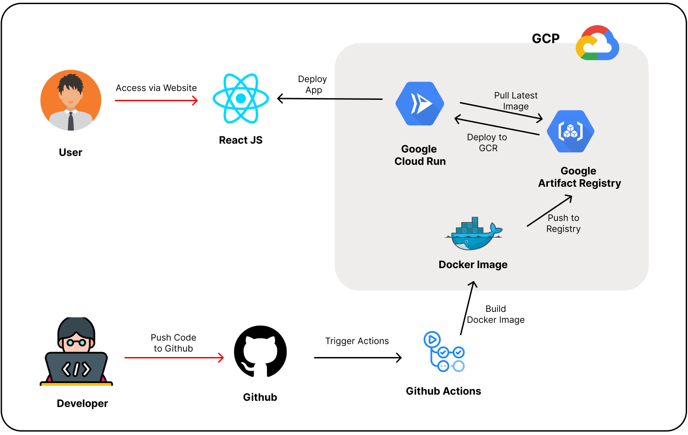

# CI/CD Pipeline with GitHub Actions, Google Cloud Run, and Google Artifact Registry

This repository outlines the implementation of a robust CI/CD pipeline utilizing GitHub Actions for automated deployment processes. The project leverages Google Cloud services, specifically Google Artifact Registry (GAR) for Docker image storage and Google Cloud Run for deploying containerized applications.



## 🚀 Overview of the Architecture

The CI/CD pipeline facilitates a seamless flow from code commits in GitHub to live application deployment in Google Cloud Run. Below is a high-level overview of the components involved:

- **GitHub**: The central hub for managing the source code.
- **GitHub Actions**: Responsible for automating the build and deployment workflows.
- **Google Artifact Registry (GAR)**: Stores built Docker images.
- **Google Cloud Run**: Handles the deployment and scaling of the application.

### Architecture Workflow

```plaintext
Code Update ➜ GitHub Action Trigger ➜ Docker Build ➜ Push to GAR ➜ Deploy on Cloud Run
```

## 🔄 Workflow Steps

1. **Code Commit**: Developers push code changes to the repository.
2. **Trigger CI/CD Pipeline**: The push event triggers the GitHub Actions workflow.
3. **Build Docker Image**: GitHub Actions builds a Docker image from the updated codebase.
4. **Push to GAR**: The Docker image is pushed to Google Artifact Registry for secure storage.
5. **Deployment to Cloud Run**: Google Cloud Run automatically pulls the latest image and deploys it, ensuring the application is live and up-to-date.
6. **Monitoring & Notifications**: Developers receive notifications about the deployment status, including any errors or successful builds.

## 🚀 Benefits of this CI/CD Setup

- **Continuous Deployment**: Automates the deployment process, allowing for rapid iterations and updates without manual steps.
- **Improved Collaboration**: Team members can work simultaneously on features without stepping on each other's toes, as changes are integrated smoothly.
- **Faster Recovery**: In case of an issue, the unique versioned Docker images allow for quick rollbacks to a previous stable version.
- **Enhanced Code Quality**: Automated testing can be integrated into the CI/CD pipeline to catch issues early in the development process.
- **Cost-Effective Scaling**: Cloud Run's pay-as-you-go model allows for efficient resource usage based on actual traffic.

## 🛠️ Setting Up

To get started with this project, follow these steps:

1. **Clone the Repository**: Use the following command to clone the repository to your local machine:
   ```bash
   git clone <repository-url>
   cd <repository-name>
   ```
2. **Make Changes**: Modify the codebase as needed. Ensure you test your changes locally before pushing.
3. **Push Changes**: Commit your changes and push them to the main branch.
   ```bash
   git add .
   git commit -m "Your commit message"
   git push origin main
   ```
4. **Monitor the Workflow**: Navigate to the Actions tab in your GitHub repository to monitor the progress of the CI/CD workflow and see the deployment status.
5. **Access the Deployed App**: Once the deployment is complete, access your application via the URL provided by Google Cloud Run.
